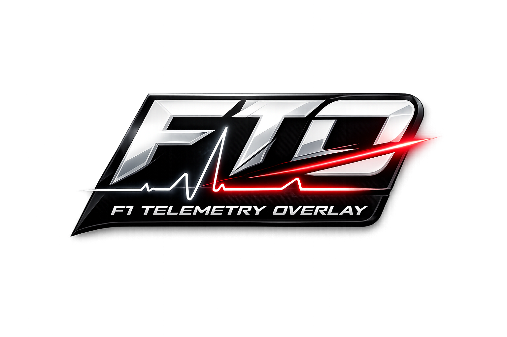

<div style="text-align: center;">
  
</div>


# F1 25 Telemetry Overlay

A lightweight Python overlay app that reads **F1 25 UDP telemetry** and displays live:

- Throttle %
- Brake %
- Gear
- Speed (km/h)
- RPM
- DRS state

The overlay is transparent, frameless, draggable, and stays on top of the game window.

---

## Features

- Reads telemetry over UDP (`0.0.0.0:20725`)
- Uses `playerCarIndex` from the F1 25 packet header — tracks the correct player car in all game modes (Time Trial, Career, etc.)
- Real-time plotting for throttle/brake traces
- In-game style overlay UI (PyQt5)
- Keyboard controls:
  - `F2`: toggle click-through
  - `F3`: toggle always-on-top
  - `Esc`: quit

---

## Project Structure

```
telemetry-f1/
├─ main.py                       # Main overlay application
├─ debugger.py                  # Standalone packet debugger
├─ fto-icon.png                 # App logo (source image)
├─ fto-icon.ico                 # App icon (Windows, multi-resolution)
├─ LICENSE                      # MIT license
├─ README.md                    # This file
├─ INSTALLER.md                 # Installer build guide
├─ pyproject.toml               # Build system + tool config
├─ requirements.txt             # Runtime dependencies
├─ requirements-dev.txt         # Dev + build dependencies
├─ build_windows.bat            # Windows build script (exe + installer)
├─ publish-release.bat         # Publish release to GitHub
├─ f1-telemetry-overlay.spec   # PyInstaller spec file
├─ f1-telemetry-overlay.iss    # Inno Setup installer script
├─ .github/workflows/
│   └─ release.yml              # GitHub Actions release workflow
├─ .gitignore
├─ dist/                        # Built executable output
│   ├─ f1-telemetry-overlay.exe
│   └─ installer/
│       └─ F1TelemetryOverlay-Setup-1.0.0.exe
└─ tests/
    ├─ __init__.py
    └─ test_telemetry_parser.py   # 23 tests, all passing
```

---

## Requirements

- Windows 10/11
- Python 3.10+ (tested on 3.13)
- F1 25 with UDP telemetry enabled

---

## Quick Start

```bash
# 1. Create and activate virtual environment
python -m venv .venv
.\.venv\Scripts\Activate.ps1

# 2. Upgrade pip
python -m pip install --upgrade pip

# 3. Install dependencies (runtime + dev)
python -m pip install -r requirements-dev.txt

# 4. Run the overlay
python main.py
```

---

## Configure F1 25 UDP Telemetry

In game settings, enable telemetry output and set:

- **UDP telemetry**: On
- **UDP IP**: `127.0.0.1` (if running locally)
- **UDP Port**: `20725` (must match `UDP_PORT` in `main.py`)
- **Send rate**: 60 Hz (recommended)

If no data appears, verify the game and app are using the same port and that no firewall is blocking local UDP traffic.

---

## Build as a Windows App (`.exe`)

### One-command build (recommended)

```bash
build_windows.bat
```

This script:
1. Creates a `.venv` if missing
2. Installs `requirements-dev.txt`
3. Cleans previous `build/` and `dist/` folders
4. Builds a one-file windowed executable with PyInstaller
5. Builds a Windows installer with Inno Setup (if installed)
6. Bundles the app icon (`fto-icon.ico`) into the executable

### Build output

```
dist\f1-telemetry-overlay.exe
dist\installer\F1TelemetryOverlay-Setup-1.0.0.exe  (if Inno Setup 6 is installed)
```

The built executable is standalone — distribute just the `.exe` file.

### Manual build

```bash
python -m pip install -r requirements-dev.txt
python -m PyInstaller --noconfirm --clean --onefile --windowed \
    --name "f1-telemetry-overlay" \
    --icon "fto-icon.ico" \
    --add-data "fto-icon.ico;." \
    --collect-all PyQt5 \
    main.py
```

---

## Build Windows Installer

The installer provides:
- Proper installation to Program Files
- Start Menu shortcuts
- Desktop shortcut (optional)
- Start with Windows option (optional)
- Clean uninstallation

### Prerequisites

Install [Inno Setup 6](https://jrsoftware.org/isdl.php) before running the build script.

### Build

```bash
build_windows.bat
```

The installer will be created at `dist\installer\F1TelemetryOverlay-Setup-1.0.0.exe`.

For manual Inno Setup build:

```cmd
"C:\Program Files (x86)\Inno Setup 6\ISCC.exe" f1-telemetry-overlay.iss
```

---

## Running the Executable

The built `dist\f1-telemetry-overlay.exe` is a standalone windowed application:

- Runs without needing Python installed
- Shows F1 logo icon in taskbar and window title bar
- Requires F1 25 to be running with UDP telemetry enabled on port `20725`

---

## Publishing to GitHub Releases

### Option 1: Manual Upload

1. Go to your GitHub repo → **Releases** → **Draft a new release**
2. Create a tag (e.g., `v1.0.0`)
3. Title: "F1 Telemetry Overlay v1.0.0"
4. Drag & drop `F1TelemetryOverlay-Setup-1.0.0.exe`
5. Publish release

### Option 2: GitHub CLI Script

1. Install [GitHub CLI](https://cli.github.com/)
2. Authenticate: `gh auth login`
3. Run the publish script:

```cmd
publish-release.bat v1.0.0
```

This will:
- Create a Git tag
- Push to remote
- Create the GitHub release
- Upload the installer as a release asset

### Option 3: GitHub Actions (Automatic)

Push a version tag to trigger automatic build and release:

```cmd
git tag v1.0.0
git push origin v1.0.0
```

The workflow will:
1. Build the Windows executable
2. Create a GitHub release
3. Upload the .exe as a release asset
4. (If Inno Setup is available) Build and upload the installer

To manually trigger a release workflow:
1. Go to **Actions** tab in GitHub
2. Select **Build and Release**
3. Click **Run workflow**
4. Enter version tag (e.g., `v1.0.0`)

---

## Development

### Install dev dependencies

```bash
python -m pip install -r requirements-dev.txt
```

This includes: PyQt5, pytest, ruff, black, mypy

### Run tests

```bash
# All tests
python -m pytest tests/ -v

# Exclude socket-dependent tests
python -m pytest tests/ -v -k "not TelemetryReceiver"

# Run with coverage
python -m pytest tests/ --cov=. --cov-report=term-missing
```

### Code quality

```bash
# Format with black
black main.py tests/

# Lint with ruff
ruff check main.py tests/

# Type-check with mypy
mypy main.py
```

---

## F1 25 Packet Layout (verified)

The app uses these F1 25 packet offsets:

```
PacketHeader (29 bytes):
  offset  0: packetFormat             uint16
  offset  2: gameYear                uint8
  offset  3: gameMajorVersion       uint8
  offset  4: gameMinorVersion       uint8
  offset  5: packetVersion           uint8
  offset  6: packetId                uint8       ← PACKET_ID_OFFSET
  offset  7: sessionUID              uint64
  offset 15: sessionTime             float32
  offset 19: frameIdentifier         uint32
  offset 23: overallFrameIdentifier  uint32
  offset 27: playerCarIndex          uint8       ← PLAYER_CAR_INDEX_OFFSET
  offset 28: secondaryPlayerCarIndex uint8

CarTelemetryData (60 bytes per car):
  offset  0: speed        uint16
  offset  2: throttle     float32
  offset  6: steer        float32
  offset 10: brake        float32
  offset 14: clutch       uint8
  offset 15: gear         int8
  offset 16: engineRPM    uint16
  offset 18: drs          uint8
```

---

## Troubleshooting

### Overlay opens but no telemetry data
- Ensure F1 25 UDP telemetry is enabled in game settings
- Confirm port is `20725` in both game and `main.py`
- Check no firewall is blocking local UDP traffic

### Wrong / ghost car data being tracked
- In Career mode or multi-car sessions, the app uses `playerCarIndex` from the packet header to track the correct car
- If data still seems wrong, enable `DEBUG_CAR_INDEX = True` in `main.py` to print the detected `playerCarIndex` value

### App closes immediately after building
- Run from terminal to capture errors:
  ```bash
  dist\f1-telemetry-overlay.exe
  ```

### Tests fail
- Make sure you're in the repo root directory
- Ensure `main.py` hasn't been modified in a way that breaks the constant offsets

---

## Optional Next Improvements

- Save overlay position and settings to a local config file
- Add system tray icon with minimize-to-tray option
- Auto-detect game window and auto-hide when game is not focused
- Add participant name verification for player index
